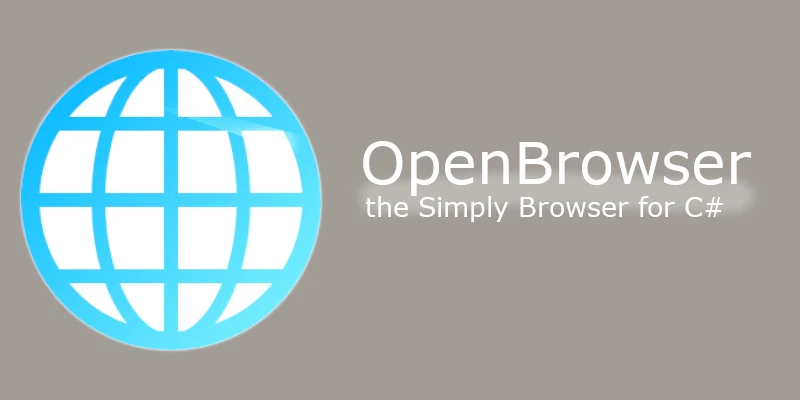

# OpenBrowser

    [![Forks][forks-shield]][forks-url]
    [![Stargazers][stars-shield]][stars-url]
    [![Issues][issues-shield]][issues-url]
    [![Unlicense License][license-shield]][license-url]
    
    

## Overview
C#製の簡易ウェブブラウザです。 
> [!NOTE]
> v1はバグが多すぎたので公開停止しました。 
> WebArchiveにでも残ってるかもしれないけどダウンロードは非推奨。

## Requirement
#### OS
[-00a8d6?logo=windows10&logoColor=white&label=Windows%2010&labelColor=0078D6&style=flat-square)](#)
[-00a8d6?logo=windows11&logoColor=white&label=Windows%2011&labelColor=0078D6&style=flat-square)](#)
#### Runtime

## Development Environments

## Usage

## Features

## Author Links
- [Twitter](https://x.com/shotadft)
- [My HP](https://www.shotadft.com/)

<!-- MARKDOWN LINKS & IMAGES -->
<!-- https://www.markdownguide.org/basic-syntax/#reference-style-links -->
[forks-shield]: https://img.shields.io/github/forks/shotadft/OpenBrowser.svg?style=for-the-badge
[forks-url]: https://github.com/shotadft/OpenBrowser/network/members
[stars-shield]: https://img.shields.io/github/stars/shotadft/OpenBrowser.svg?style=for-the-badge
[stars-url]: https://github.com/shotadft/OpenBrowser/stargazers
[issues-shield]: https://img.shields.io/github/issues/shotadft/OpenBrowser.svg?style=for-the-badge
[issues-url]: https://github.com/shotadft/OpenBrowser/issues
[license-shield]: https://img.shields.io/github/license/shotadft/OpenBrowser.svg?style=for-the-badge
[license-url]: https://github.com/shotadft/OpenBrowser/blob/main/LICENSE.md
